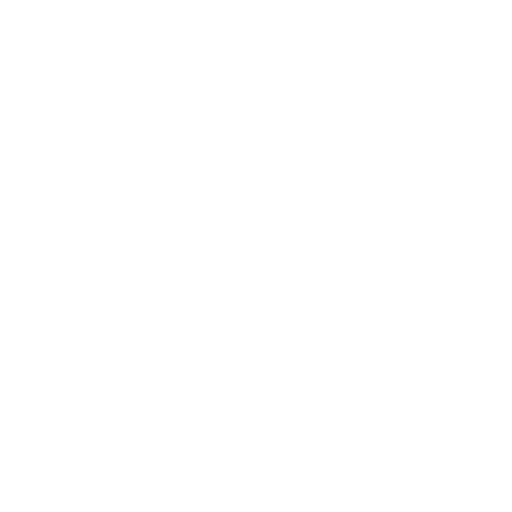
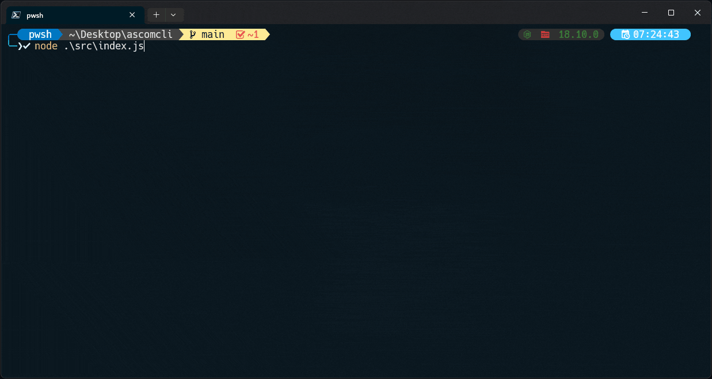

<!-- Title: -->
  
  <h1><a href="https://github.com/ASJordi/ascomcli">ascomcli</a></h1>
<!-- Labels: -->
  <!-- First row: -->
  
  
  
  

CLI that helps you to write better commit messages

### Features

- Add staged files to the commit message
- Add untracked files to the commit message
- Add a commit message using conventional commits and emojis
- CLI interactive mode

<!-- 

  

 -->